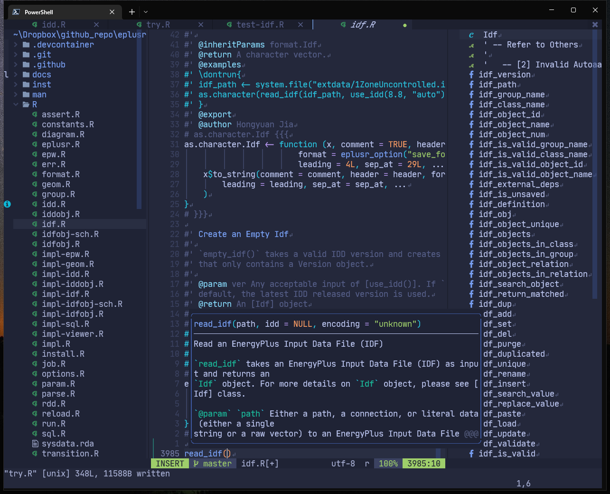

## Personal dotfiles on Windows and Linux

Dotfiles managed by [chezmoi](https://www.chezmoi.io/). Apps on Windows managed
via [scoop](https://scoop.sh/) and [chocolatey](https://chocolatey.org/) 

